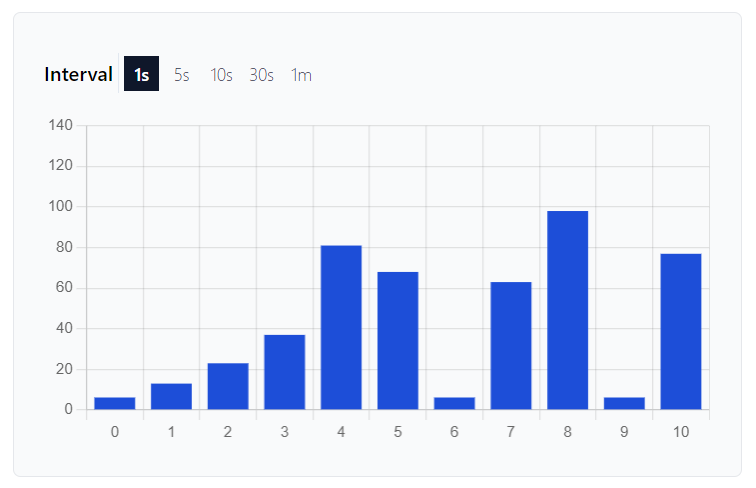

<h1>WebSocket in Angular - Building A Real-Time Application</h1>

Working demo of RxJs [webSocket](https://rxjs.dev/api/webSocket/webSocket).

The demo includes:

-  a Node.js backend server (`server` directory) that implements a WebSocket server. Upon connecting to the server, the client will receive randomly generated numbers with a default interval of 1 second.
-  an Angular application (`client` directory) that uses the webSocket (RxJs) to receive data through the WebSocket. The user can change the interval. Client will also try to reconnect in case the connection is lost for some reason.

Run npm install for both `server` and `client` directories.

To start the server, run `node src/server.js` inside the `server` directory.

To start the client, run `npm run start` inside the `client` directory.

<h4>Disclaimer</h4>
This is just a demo that uses the plain version of WebSocket. For production applications you should always use the secure version of the protocol.